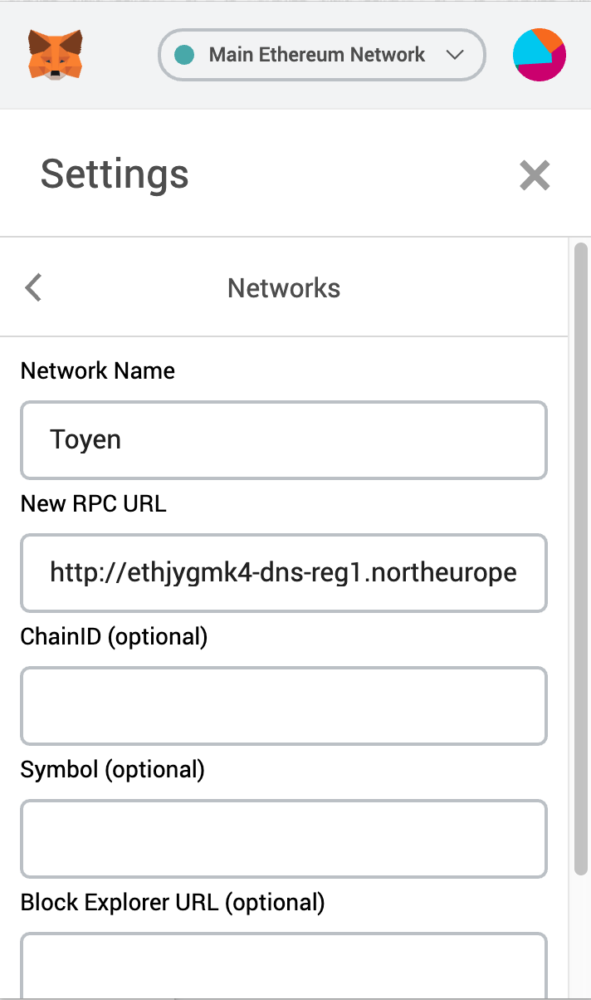

# SDK

You can connect to the platform with the SDK, or you can extend the platform itself by developing and deploying smart contracts. This section outlines how to use the SDK.

## Getting started

> To install the SDK to your project, just use NPM in your project.

```
npm install @brreg/sdk
```

To develop on BrregCapTable, you start out by installing the SDK on your development machine. 

You should also install MetaMask in Chrome as the middleware between your application and the blockchain. [Download here](https://metamask.io/).

### Example frotend application
It can be hard getting started. We recommend you <a href="https://gitlab.com/blockchangers/brreg/tree/master/packages/forvalter" target="_blank">take a look at the source code of our example application</a> to get a feel of the SDK. The application is written in Vue.js with VueX. A <a href="https://blockchangers.gitlab.io/brreg/" target="_blanK">live version of the example application is available on Github</a>.

### Example backend application
If you are creating a backend service with NodeJs. Take a look at this demo application useing the SDK. <a href="https://gitlab.com/blockchangers/brreg-typescript-starter" target="_blank">brreg-typescript-starter</a>.

In a backend applicatin you dont rely on the user providing a connection to Brreg network. To mock this we can do the following in Typescript.
```typescript
  import { ethers } from 'ethers'
  const provider = new ethers.providers.JsonRpcProvider('http://ethjygmk4-dns-reg1.northeurope.cloudapp.azure.com:8540')
  const ProviderWithWallet = ethers.Wallet.createRandom().connect(provider)
```

## How do users connect to BrregCapTable blockchain network? 

As BrregCapTable is a service facilitated by blockchain technology, end-users will interact with your service in ways that differs from a regular client-server approach.

Instead of credentials authenticating the user and giving the user the correct access, end users are expected to use a browser with blockchain wallet functionality. This functionality is available in

* Google Chrome, Firefox, Brave and Microsoft Edge when installing the [Metamask plugin](https://chrome.google.com/webstore/detail/metamask/nkbihfbeogaeaoehlefnkodbefgpgknn)
* The Opera web browser

As a frontend developer, you must download this plugin and use it when developing frontend applications.

### Web3 Browser Detection

The first thing your app will want to do is verify whether the user is using MetaMask or not, which is simple using a check like `if (typeof window.ethereum !== 'undefined') { /* deal with it */ }`.

### Connecting to the BrregCapTable Network

In the top-right menu of MetaMask, you can select the network that you are currently connected to. Among several popular defaults, you'll find `Custom RPC`. Use it and set

* Network Name to `Toyen` (its not important what you call it, just for your own reference)
* New RPC URL to `http://ethjygmk4-dns-reg1.northeurope.cloudapp.azure.com:8540`



Since your seed phrase is the power to control all your accounts, it is probably worth keeping at least one seed phrase for development, separate from any that you use for storing real value. One easy way to manage multiple seed phrases with MetaMask is with multiple browser profiles, each of which can have its own clean extension installations.

<aside class="note">Note that users of your application will have to connect Metamask to the Toyen network too while BrregCapTable remain in development as a beta.</aside>

### User State

There are a settings you should keep in mind when interacting with Metamask:

```javascript
ethereum.networkVersion
ethereum.selectedAddress
```

> Both of these are available synchronously. The networkVersion for BrregCapTable is `53387025`.

- What is the current network?
- What is the current account?

<aside class="note">If the networkVersion is not 53387025, the user is not connected to the BrregCapTable. Guide the user to correcting this. See the "Connecting to the BrregCapTable Network" chapter above.</aside>

### Logging In

> When you're ready to request the user log in, you can call this simple function.

```javascript
ethereum.enable();
```

> Since it returns a promise, if you're in an `async` function, you may log in like this.

```javascript
const accounts = await ethereum.enable()
const account = accounts[0] // We currently only ever provide a single account,
                            // but the array gives us some room to grow.
```

This promise-returning function resolves with an array of hex-prefixed ethereum addresses, which can be used as general account references when sending transactions.

Over time, this method is intended to grow to include various additional parameters to help your site request all the setup it needs from the user during setup.

## Accessing the user's wallet
> To access the user's wallet, use this code:

```javascript
let ethereum
if (typeof window.ethereum !== 'undefined' || (typeof window.web3 !== 'undefined')) {
    ethereum = window.ethereum;
}
```

The first line of code includes the SDK. This needs to be installed before you can use it. See [Getting started](#getting-started). 

In a regular client-server architecture, the user's browser works as a thin client, where the business logic is running on the server. In an application utilizing blockchain, the business logic is run in the user's browser and she connects directly to the backend/blockchain. For this to work, you need to use her access keys for every write operation. 

<aside class="warning">
This code snippet is essential for using any of the following methods from the SDK.
</aside>

MetaMask injects a global API into websites visited by its users at `window.ethereum` (Also available at `window.web3.currentProvider` for legacy reasons). This API allows websites to request user login, load data from blockchains the user has a connection to, and suggest the user sign messages and transactions. You can use this API to detect a user of a web3 browser.

If you want to deep dive into the Metmask API and their best practices, check the [Metamask documentation](https://metamask.github.io/metamask-docs/API_Reference/Ethereum_Provider).

## How to use the SDK

In BrregCapTable, there are mainly four classes to work with:
* Company API - All functionality connected to a spesific company.
* Company Factory API - Functionality to create a new company.
* Entity Registry API - Functionality to store or get information about a person or a company.
* Registry ofc Cap Tables API - Functionality working on all companies in this network.

### Init
In each class there is an `init` function. This function is the bridge between the users Ethereum network connection (through Metamask) and the smart contracts the frontend know how to work with. 

So before useing a spesific API class, the developer should init the api class passing in the users Ethereum network connection (which you get from the Browser thorugh Metamask).
```javascript
let ethereum
if (typeof window.ethereum !== 'undefined' || (typeof window.web3 !== 'undefined')) {
    ethereum = window.ethereum;
}

const RegistryOfCapTables = require("@brreg/sdk").RegistryOfCapTables
const RegistryOfCapTablesContract = await RegistryOfCapTables.init(ethereum);
// RegistryOfCapTablesContract is now an instance of this smart contract. and we can run its interfaces. By example await RegistryOfCapTablesContract.list() to list all the companies saved within this smart contract.
```

## Registry Of Cap Tables

While most functions are specific to a given company, the functions in this chapter are platform-wide (they relate to all of BrregCapTable).

### init(externalSignerProvider: Signer | any, proxyAddress?: string)

> The Class always has to be initialized before using

```javascript
const RegistryOfCapTables = require("@brreg/sdk").RegistryOfCapTables
const RegistryOfCapTablesContract = await RegistryOfCapTables.init(ethereum);
```

| Parameter              | Type                      | Description                                                                                                                                    |
| ---------------------- | ------------------------- | ---------------------------------------------------------------------------------------------------------------------------------------------- |
| externalSignerProvider | Ethereum provider         | Should be set to the user's wallet i.e. `ethereum` from the section [Accessing the user's wallet](#accessing-the-user-39-s-wallet) from above. |
| proxyAddress           | String (Ethereum address) | If you want to point the SDK at another blockchain than the [Staging server](#networks-and-endpoints)                                          |

### list() 
| Parameter | Type                      | Description |
| --------- | ------------------------- | ----------- |
| RETURN    | Promise< CapTableInfo[] > |

```javascript
const list = await RegistryOfCapTablesContract.list();
console.log(list);
```

> Example of return data:

```javascript
return [ 
    { name: 'Empty inc.',
    totalSupply: 0,
    denomination: 0,
    denominationPerShare: 0,
    director:
     { uuid: '195199646563',
       name: 'Ethel Rice',
       country: 'Norway',
       city: 'Oslo',
       postalcode: '3014',
       streetAddress: '843 Fewus Center',
       type: 'person',
       address: '0xe88C9fE335185b62a530d2B67A2438e55E5bf39A' },
    address: '0x2358cEE56BEf4Ac13d65e9F96677f6E40b0abC3E',
    isController: false },
]
```

List all companies on the platform

BrregCapTable deals only with companies that have been onboarded. Use this code to list these.

## Company Factory

Used to onboard new company.

### init(externalSignerProvider: Signer | any, proxyAddress?: string) : Promise<StockFactory> 

> The Class always has to be initialized before using

```javascript
const CompanyFactoryClass = require("@brreg/sdk").StockFactory;
const companyFactory = await CompanyFactoryClass.init(ethereum);
```

| Parameter              | Type     | Description                                                                                                                                    |
| ---------------------- | -------- | ---------------------------------------------------------------------------------------------------------------------------------------------- |
| externalSignerProvider | Provider | Should be set to the user's wallet i.e. `ethereum` from the section [Accessing the user's wallet](#accessing-the-user-39-s-wallet) from above. |
| proxyAddress           | String   | If you want to point the SDK at another blockchain than the [Staging server](#networks-and-endpoints)                                          |

### createNew(name: string, uuid: string, options: { partitions: string[], symbol: string }) : Promise<Stock> 

```javascript
const Company = await companyFactory.createNew("Blockchangers AS", "915772137");
```

> Note that you need to wait for the transaction to go through before continuing. This can take up to 5 seconds. 

This actions will queue the company for verification.

| Parameter  | Type             | Description                                                      |
| ---------- | ---------------- | ---------------------------------------------------------------- |
| name       | String           | Business name                                                    |
| uuid       | String           | Organization number, note that it's a string                     |
| options    | Object           | Object with the following possible options                       |
| partitions | String[]         | List of share classes as strings. Example ['a-share', 'b-share'] |
| symbol     | String           | Shorthand for the company, 4 characters length.                  |
| RETURN     | Promise<Company> | [Company API](#company-api)                                      |


## Entity Registry

### init(externalSignerProvider: Signer | any, proxyAddress?: string)

```javascript
const EntityRegistryClass = require("@brreg/sdk").EntityRegistry
const entityRegistry = await EntityRegistryClass.init(ethereum);
```

| Parameter              | Type                      | Description                                                                                                                                    |
| ---------------------- | ------------------------- | ---------------------------------------------------------------------------------------------------------------------------------------------- |
| externalSignerProvider | Provider                  | Should be set to the user's wallet i.e. `ethereum` from the section [Accessing the user's wallet](#accessing-the-user-39-s-wallet) from above. |
| proxyAddress           | String (Ethereum address) | If you want to point the SDK at another blockchain than the [Stagning server](#networks-and-endpoints)                                         |
| RETURN                 | Promise<EntityRegistry>   | If you want to point the SDK at another blockchain than the [Stagning server](#networks-and-endpoints)                                         |


### generateAddress() : Promise<string> 
```javascript
const arbitraryAddress = await entityRegistry.generateAddress();
```

Many companies will have stockholders who are not on the BrregCapTable platform. Hence the shares can not be sent to the user. Technically these shares still need to be generated on the blockchain, and put on seperate users. This method generates an arbitrary address for you to put shares on, for users not on the platform. Generate one address for every user who does not have a prior address, i.e. those not registered as users on BrregCapTable.

| Parameter | Type                      | Description               |
| --------- | ------------------------- | ------------------------- |
| RETURN    | String (Ethereum address) | A random ethereum address |


### allTransactionsAllCapTables(uuid: string) : Promise<CapTableTransactions[]> 
```javascript
let captable = await entityRegistry.allTransactionsAllCapTables("24078612345");
console.log(captable);
```

> Example of return data:

```javascript
[ { capTable:
     { name: 'Empty inc.',
       totalSupply: 0,
       denomination: 0,
       denominationPerShare: 0,
       director: [Object],
       address: '0x2358cEE56BEf4Ac13d65e9F96677f6E40b0abC3E',
       isController: false },
    transactions: [] },
]
```

Returns all transactions done for the given person. This function can be used for most views, analytics and statistics that you want to present the user with. Get all the data with this function, then filter and customize the returned data, before presenting it to the user.

| Parameter | Type   | Description                                        |
| --------- | ------ | -------------------------------------------------- |
| uuid      | String | The uuid of which you want to get all transactions |

> interface CapTableTransactions 

```javascript
interface CapTableTransactions {
  capTable: CapTableInfo
  transactions: Transaction[]
}
```

### getEntityByUuid(uuid: string) : Promise<EntityData>
```javascript
let entityData = await entityRegistry.getEntityByUuid("915772137");
console.log(entityData);
```

Get data about the given entity. 

| Parameter | Type   | Description                                                                            |
| --------- | ------ | -------------------------------------------------------------------------------------- |
| uuid      | String | The personal identification number of a person, or a organization number of a company. |

> type EntityData

```javascript
{
  address: string
  uuid: string
  type: string
  name: string
  country: string
  city: string
  postalcode: string
  streetAddress: string
}
```

### getEntityByAddress(address: string)

```javascript
let entityData = await entityRegistry.getEntityByAddress("0x2358cEE56BEf4Ac13d65e9F96677f6E40b0abC3E");
console.log(entityData);
```

Gets the given entity. Use an ethereum address as lookup parameter.

### addEntity(data: EntityData) : Promise<ContractReceipt>

```javascript
let companyFactory = await StockFactory.init(ethereum);
let Company = await companyFactory.createNew("Blockchangers AS", "915772137")
let companyAddress = await Company.getAddress()

const entityRegistry = await EntityRegistry.init(ethereum)
let tx = await entityRegistry.addEntity({
    address: companyAddress,
    uuid: "915772137",
    type: 'person' , // or 'organization
    name: "Blockchangers AS" , 
    country: "Norway",
    city: "Oslo",
    postalcode: "0179",
    streetAddress: "Møllergata 6"
});
await tx.wait();
```

Adds an entity to the entityRegistry.

> Note that you need to wait for the transaction to go through before continuing. This can take up to 5 seconds

| Parameter     | Type   | Description                                                                             |
| ------------- | ------ | --------------------------------------------------------------------------------------- |
| EntityData    | object | The EntityData object is described with the following parameters                        |
| address       | string | The blockchain address for the given company or  person                                 |
| uuid          | string | String. The organizational number of a company or the identification number of a person |
| type          | string | String. 'person' or 'organization.                                                      |
| name          | string | String. Name of the entity.                                                             |
| country       | string | String. Country of the entity.                                                          |
| city          | string | String. City of the entity.                                                             |
| postalcode    | string | String. Postal code of the entity.                                                      |
| streetAddress | string | String. Street Address of the entity.                                                   |

### updateEntity(data: EntityData) : Promise<ContractReceipt>

Updates an entity in the entityRegistry.

| Parameter     | Type   | Description                                                                             |
| ------------- | ------ | --------------------------------------------------------------------------------------- |
| EntityData    | object | The EntityData object is described with the following parameters                        |
| address       | string | The blockchain address for the given company or person                                  |
| uuid          | string | String. The organizational number of a company or the identification number of a person |
| type          | string | String. 'person' or 'organization.                                                      |
| name          | string | String. Name of the entity.                                                             |
| country       | string | String. Country of the entity.                                                          |
| city          | string | String. City of the entity.                                                             |
| postalcode    | string | String. Postal code of the entity.                                                      |
| streetAddress | string | String. Street Address of the entity.                                                   |

## Company API

### init(externalSignerProvider: Signer | any, address: string, proxyAddress?: string)

> The Class always has to be initialized before using

```javascript
const CompanyClass = require("@brreg/sdk").Stock;
const Company = await CompanyClass.init(ethereum, "0x2358cEE56BEf4Ac13d65e9F96677f6E40b0abC3E");
```

| Parameter              | Type              | Description                                                                                                                                    |
| ---------------------- | ----------------- | ---------------------------------------------------------------------------------------------------------------------------------------------- |
| externalSignerProvider | Ethereum provider | Should be set to the user's wallet i.e. `ethereum` from the section [Accessing the user's wallet](#accessing-the-user-39-s-wallet) from above. |
| address                | String            | The ethereum address of the company. In the future, this will be able to accept UUID.                                                          |
| proxyAddress           | (optional) string | If you want to point the SDK at another blockchain than the [Stagning server](#networks-and-endpoints)                                         |
| RETURN                 | Promise<Company>  | [Company API](#company-api)                                                                                                                    |

> In next version of Company API, this will be able to accept UUID instead of the Etehreum address to initiate the company class.

### address()

Returns a new Company Class for this address.

### balanceOf(address: string) : Promise<number> 

```javascript
const CompanyClass = require("@brreg/sdk").Stock;
const Company = await CompanyClass.init(ethereum, "0x2358cEE56BEf4Ac13d65e9F96677f6E40b0abC3E");

let usersAmountOfShares = Company.balanceOf("0xab5801a7d398351b8be11c439e05c5b3259aec9b");
console.log(usersAmountOfShares);
```

Returns the number of shares for the given ethereum address for any partition, be it a person, company or smart contract.

### balanceOfByPartition(partition: string, address: string) : Promise<number>

Returns the number of shares of the given share class for the given ethereum address.

### denominationPerShare() : Promise<number> 

Returns the denomination of a share i.e., "Pålydende" in Norwegian.

### director() : Promise<string> 

Returns the board director of the company.

### getDefaultPartitions(asBytes = false) : Promise<string[]> 

Returns an array of default partitions. By default, they will be returned as Strings. 


### totalSupply() : Promise<number> 

```javascript
const CompanyClass = require("@brreg/sdk").Stock;
const Company = await CompanyClass.init(ethereum, "0x2358cEE56BEf4Ac13d65e9F96677f6E40b0abC3E");

let totalAmountOfSharesInTheCompany = await Company.totalSupply();
console.log(totalAmountOfSharesInTheCompany);
```

Returns the total number of shares.

### getTotalSupplyByPartition(partition: string) : Promise<number> 

Returns the number of shares in the given share class.

### info() : Promise<CapTableInfo>

Returns a collection of information about the company. 
name, totalSupply, denomination, denominationPerShare, director, address, isController

### isController(address: string) : Promise<boolean>

Returns true if the given address is a controller of the company. An address can be a person or a smart contract.

A controller is an address that can make certain changes to the company — by example transferring board director role. Controllers can in a transparent and with documentation requirement do certain transactions like transferring stocks. This could, by example, be used in the case where a person has died, and the shares need to be transferred to the heir. 

### setDenomination(newDenomination: number) :Promise<TransactionResponse>

Updates the denomination. This supplied number should not be the denomination per share, but the total denomination: denomination * number of shares e.g. NOK 2 * 30000 shares = denomination 60000.

### shareholders() : Promise<Shareholder[]>

Returns all shareholders. 

### transactions(filter?: { address?: string }) : Promise<Transaction[]>

Returns all transactions

### name() : Promise<string>

Returns the name of the company.


### partitionsOf(address: string, asBytes = false) : Promise<string[]>

Returns all partitions of shares an address is in ownership of.

### transferDirector(address: string) : Promise<TransactionResponse> 

Change the board director of the company.

### uuid() : Promise<string>

Returns the organizational number of the company.

### transfer(toUuid: string, numberOfSharesToTransfer: number, options?: { partition?: string, data?: string }) : Promise<TransactionResponse>

```javascript
const CompanyClass = require("@brreg/sdk").Stock;
const company = await CompanyClass.init(ethereum, "0x2358cEE56BEf4Ac13d65e9F96677f6E40b0abC3E");
company.transfer("24078612345", 100);
await tx.wait();
```

> Note that you need to wait for the transaction to go through before continuing. This can take up to 5 seconds


| Parameter                | Type              | Description                                                                             |
| ------------------------ | ----------------- | --------------------------------------------------------------------------------------- |
| toUuid                   | string            | The personal identification number of a person, or an organization number of a company. |
| numberOfSharesToTransfer | number            | Amount                                                                                  |
| options                  | (optional) object | A object detailed with the following parameters.                                        |
| data                     | string            | This can be an arbitrary blob of data that Companies can utilize in different ways.     |
| partition                | string            | The class of the shares to issue.                                                       |

Function for moving shares from one person or company, another. Note that you as a developer do not input who the shares come from. When the user initiates the transfer from your service, the transaction is signed and sent from them. Hence the shares are sent from her. 

<aside class="notice">Shares are transferred from the user initiating this function.</aside>

### operatorTransfer(fromUuid: string, toUuid: string, numberOfSharesToTransfer: number, options?: { partition?: string, data?: string, operatorData?: string }) :: Promise<TransactionResponse>

If a controller wants to force a transaction the controller may use this function to make the transactions. The controller can attach data about the forced transaction in operatorData. 

> Note that you need to wait for the transaction to go through before continuing. This can take up to 5 seconds


| | Parameter                               | Type                           | Description                                                                             |                                                                             |
| | --------------------------------------- | --------------------------- | --------------------------------------------------------------------------------------- |---------------------------------------------------------------------------- |
| | toUuid                                      |  string                        |  The personal identification number of a person, or an organization number of a company. ||
| | numberOfSharesToTransfer  |  number                        |  Amount                                                                                  |                                                                                  |
| | options                                    |  (optional) object  |  A object detailed with the following parameters.                                        |                                        |
| | data                                          |  string                        | This can be an arbitrary blob of data that companies can utilize in different ways.     |     |
| | partition                                |  string                        |  The class of the shares to issue.                                                       |                                                       |
| operatorData             | string            | This can be an arbitrary blob of data that companies can utilize in different ways.     |

### issue(toUuid: string, numberOfSharesToTransfer: number, options?: { data?: string, partition?: string })  : Promise<TransactionResponse>

```javascript
const CompanyClass = require("@brreg/sdk").Stock;
const Company = await CompanyClass.init(ethereum, "0x2358cEE56BEf4Ac13d65e9F96677f6E40b0abC3E");

let tx = Company.issue("24078612345", 1000);
await tx.wait();
```

Issue new shares to the given entity.

| Parameter                | Type              | Description                                                                             |
| ------------------------ | ----------------- | --------------------------------------------------------------------------------------- |
| toUuid                   | string            | The personal identification number of a person, or an organization number of a company. |
| numberOfSharesToTransfer | number            | Amount                                                                                  |
| options                  | (optional) object | A object detailed with the following parameters.                                        |
| data                     | string            | This can be an arbitrary blob of data that companies can utilize in different ways.     |
| partition                | string            | The class of the shares to issue.                                                       |


### redeem(numberOfSharesToRedeem: number, options?: { partition?: string, data?: string })

Remove shares from the sending address.

| Parameter              | Type              | Description                                                                         |
| ---------------------- | ----------------- | ----------------------------------------------------------------------------------- |
| numberOfSharesToRedeem | number            | AMount of shares to remove.                                                         |
| options                | (optional) object | A object detailed with the following parameters.                                    |
| data                   | string            | This can be an arbitrary blob of data that companies can utilize in different ways. |
| partition              | string            | The class of the shares to redeem.                                                  |

### operatorRedeem(fromUuid: string, numberOfSharesToRedeem: number, options?: { partition?: string, data?: string, operatorData?: string }) : Promise<TransactionResponse>

Remove shares from the sending address.

| Parameter              | Type              | Description                                                                         |
| ---------------------- | ----------------- | ----------------------------------------------------------------------------------- |
| fromUuid               | string            | From which UUID shall the operator remove shares.                                   |
| numberOfSharesToRedeem | number            | Amount of shares to remove.                                                         |
| options                | (optional) object | A object detailed with the following parameters.                                    |
| data                   | string            | This can be an arbitrary blob of data that companies can utilize in different ways. |
| partition              | string            | The class of the shares to redeem.                                                  |
| operatorData           | string            | This can be an arbitrary blob of data that companies can   in different ways.       |


